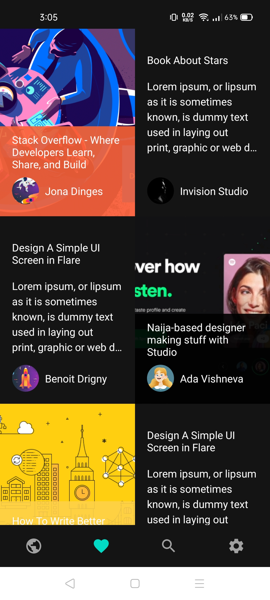
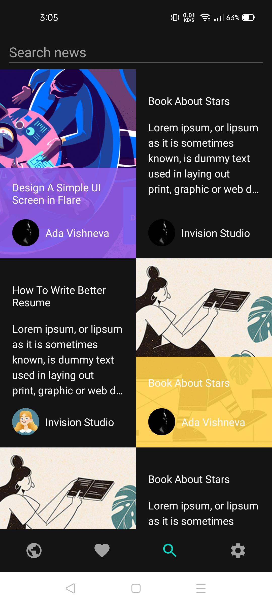
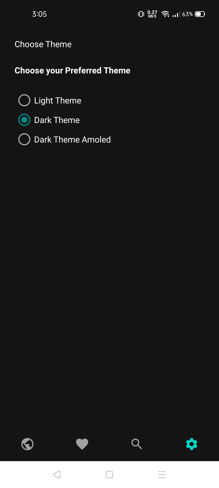

# DESCRIPTION

 #### App Name - MVVM-NEWS
 #### Language Used - JAVA
 #### Architecture - MVVM
 
 # COMPONENTS
 
 1. Android Architetcure Components
 2. DataBinding
 3. Navigation Component
 4. Retrofit
 5. Material Design Components
 
 # NOTE - 
 
  This Application is in progress.......
  Only UI is implemented, Dummy Data is populated as of now.
  
  # SCREENSHOTS
  
  

  
  
  
  
